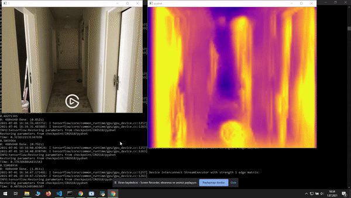
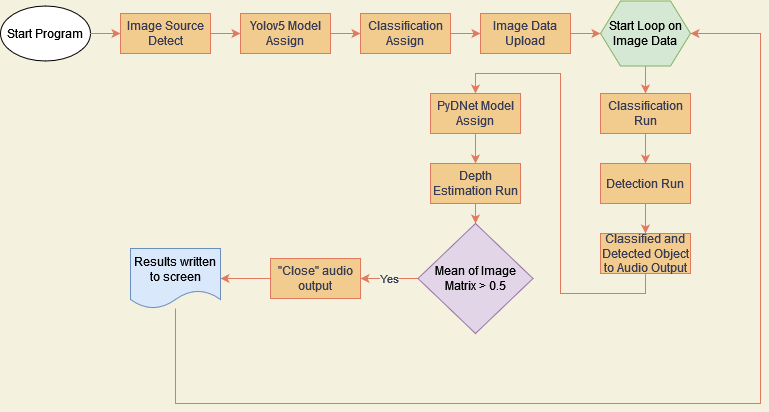

# Object Detection and Depth Estimation

## Graduation Thesis

### About

This project is my Bachelor's Degree Graduation Thesis. 
It's aim to develop an computer vision based application to visual impaired individuals for help them in their daily routines. 
You can check out my thesis written in Turkish.

---

### Working Example

This is a sample work of project video with applied **2x speed**. 

---

### Flow Chart

* Program starts
* Image source (like image, video or stream) detected
* Yolov5 model assigned (Object Detection model of project)
* Classification model assigned 
* Image data uploaded
* Starts loop on image data
* Classification model runs for object classification
* Detection model runs for object detection
* Classified and detected object output with audio
* PyDNet model assigned (Depth Estimation model of project)
* Depth Estimation model runs
* If mean of image matrix bigger than 0.5 then "Close" audio output is given.
* Results written to screen
* Back to the loop (for stream video)
